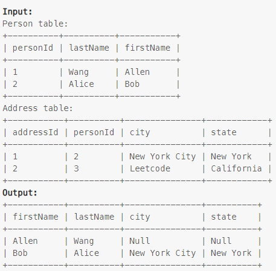

### Task

___

Write an SQL query to report the first name, last name, city, and state of each person in the Person table. If the address of a personId is not present in the Address table, report null instead.

Return the result table in any order.

### Example

___

> 

### SQL query

___

#### My

```sql
SELECT p.firstName, p.lastName, a.city, a.state
FROM person p
LEFT JOIN address a ON p.personId = a.personId;
```
