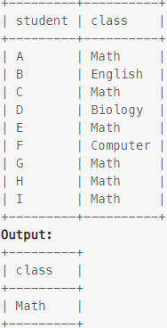

### Task

___

Write an SQL query to report all the classes that have at least five students.

### Example

___

> 

### SQL query

___

#### My

```sql
SELECT class
FROM courses
GROUP BY class
HAVING COUNT(student) >= 5;
```
