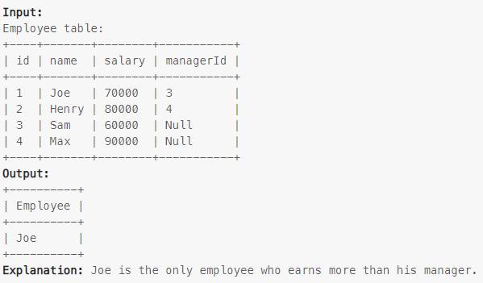

### Task

Write an SQL query to find the employees who earn more than their managers.

Return the result table in any order.

### Example

> 

### SQL query

```sql
SELECT e.name Employee
FROM employee e
JOIN employee m ON e.managerId = m.id
WHERE e.salary > m.salary;
```

```sql
SELECT e.name Employee
FROM employee e
JOIN employee m ON e.managerId = m.id AND e.salary > m.salary;
```
