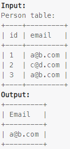

### Task

___

Write an SQL query to report all the duplicate emails.

Return the result table in any order.

### Example

___

> 

### SQL query

___

#### My

```sql
SELECT DISTINCT(p.email)
FROM person p
JOIN person pr ON p.email = pr.email AND p.id != pr.id;
```

#### LeetCode

```sql
SELECT email
FROM person
GROUP BY email
HAVING COUNT(email) > 1;
```
