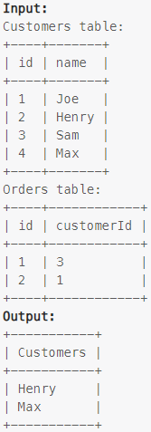

### Task

___

Write an SQL query to report all customers who never order anything.

Return the result table in any order.

### Example

___

> 

### SQL query

___

#### My

```sql
SELECT c.name customers
FROM customers c
LEFT JOIN orders o ON c.id = o.customerId 
WHERE o.customerId IS NULL;
```

#### LeetCode

```sql
SELECT customers.name as customers
FROM customers
WHERE customers.id NOT IN (SELECT customerId FROM orders);
```
