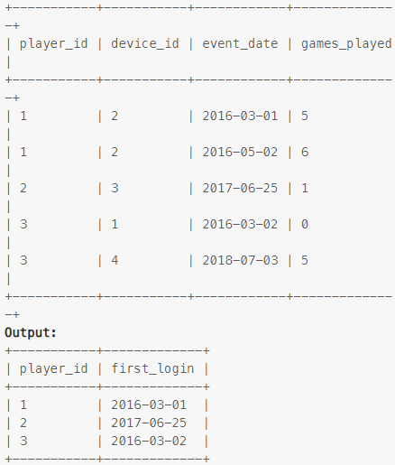

### Task

___

Write an SQL query to report the first login date for each player.

### Example

___

> 

### SQL query

___

#### My

```sql
SELECT DISTINCT player_id, FIRST_VALUE(event_date) OVER (PARTITION BY player_id ORDER BY event_date ASC) first_login 
FROM activity;
```

#### Others

```sql
SELECT player_id, MIN(event_date) first_login 
FROM activity 
GROUP BY player_id;
```
