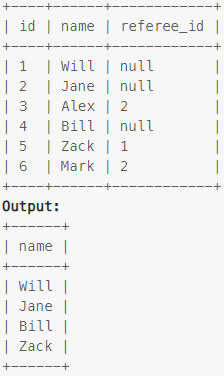

### Task

___

Write an SQL query to report the names of the customer that are not referred by the customer with id = 2

### Example

___

> 

### SQL query

___

#### My

```sql
SELECT name
FROM customer
WHERE referee_id IS NULL OR referee_id != 2;
```
