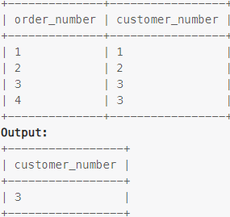

### Task

___

Write an SQL query to find the customer_number for the customer who has placed the largest number of orders.

### Example

___

> 

### SQL query

___

#### My

```sql
SELECT customer_number
FROM orders
GROUP BY customer_number
ORDER BY COUNT(customer_number) DESC
LIMIT 1
```
