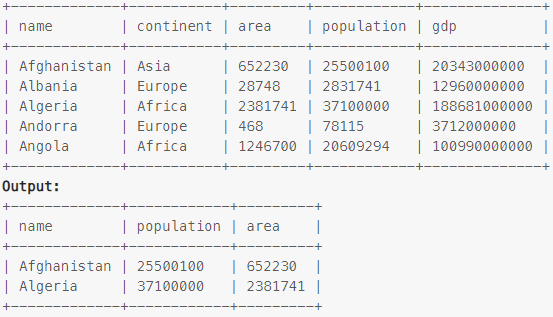

### Task

___

Write an SQL query to report the name, population, and area of the big countries.

### Example

___

> 

### SQL query

___

#### My

```sql
SELECT name, population, area 
FROM world
WHERE population >= 25000000 OR area >= 3000000;
```
