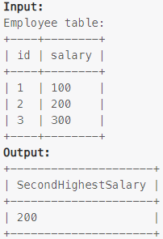

### Task

___

Write an SQL query to report the second highest salary from the Employee table. If there is no second highest salary, the query should report null.Write an SQL query to report the second highest salary from the Employee table. If there is no second highest salary, the query should report null.

### Example

___

> 

### SQL query

___

#### My

```sql
SELECT (SELECT DISTINCT salary FROM employee ORDER BY salary DESC LIMIT 1,1) SecondHighestSalary 
```
