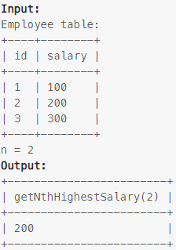

### Task

___

Write an SQL query to report the second highest salary from the Employee table. If there is no second highest salary, the query should report null.Write an SQL query to report the second highest salary from the Employee table. If there is no second highest salary, the query should report null.

### Example

___

> 

### SQL query

___

#### My

```sql
DELIMITER $$
CREATE FUNCTION getNthHighestSalary(N INT) RETURNS INT
BEGIN
    SET N = N - 1;
    RETURN (
	    SELECT salary
	    FROM employee
	    ORDER BY salary
	    LIMIT N,1
    );
END; $$
```
