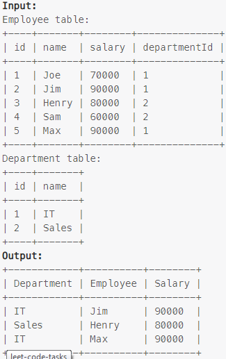

### Task

___

Write an SQL query to find employees who have the highest salary in each of the departments.

### Example

___

> 

### SQL query

___

#### My

```sql
SELECT res.department, res.employee, res.salary 
FROM (
    SELECT d.name department, e.name employee, e.salary, MAX(salary) OVER(PARTITION BY departmentId) max_s
    FROM employee e
    INNER JOIN department d ON e.departmentId = d.id 
) res
WHERE res.salary = res.max_s;
```

#### LeetCode

```sql
SELECT Department.name AS 'Department', Employee.name AS 'Employee', Salary
FROM Employee
JOIN Department ON Employee.DepartmentId = Department.Id
WHERE (Employee.DepartmentId , Salary) IN (  
    SELECT DepartmentId, MAX(Salary)
    FROM Employee
    GROUP BY DepartmentId);
```
